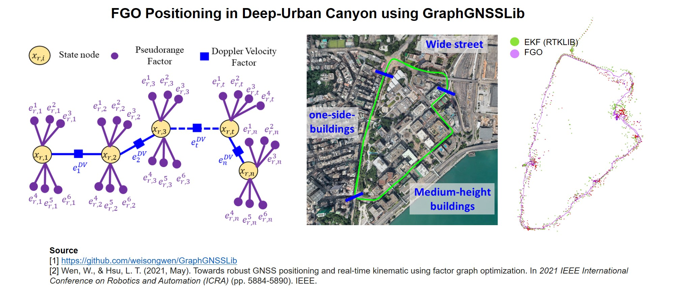

  
Summary

  **Motivation**
  - To improve GNSS positioning accuracy in urban environments, where signal degradation due to blockages and multipath errors caused by tall buildings is a significant challenge.

  **Methods**
  - Implemented Factor Graph Optimization (FGO)-based positioning, which iteratively searches for the optimal position by minimizing the sum of all the historical measurement residuals.
  - Collaborated with Samsung Electronics to improve smartphone GNSS chipsets using FGO for enhanced accuracy and outlier exclusion.

  **Results**
  - FGO achieved better accuracy in urban settings than EKF due to its ability to handle multipath interference and time-correlated noise.
  - Empirical and theoretical analyses showed that the FGO-based system’s integrity, using Monte Carlo simulations, needs further work in error distribution estimation and overbounding techniques for reliable protection levels.

  **What I’ve Learned**
  - Gained experience in applying FGO to real-world GNSS challenges, particularly in urban environments.
  - Understood the impact time-correlated noise in FGO-based positioning method by the error analysis. 
  - Implementation of FGO using MATLAB and Ceres-solver in C++ 
  Applied FGO to urban dataset collected in Hong Kong

---

### Urban Positioning with FGO-based GNSS systems
GNSS signals are significantly degraded in urban environments due to frequent signal blockage and multipath errors caused by tall buildings in urban canyons. The Factor Graph Optimization (FGO)-based positioning algorithm iteratively searches for the optimal position by minimizing the measurement residuals—i.e., the difference between the estimated and actual measurements.FGO is derived from Maximum a Posteriori (MAP) estimation and is connected to non-linear least squares through factorization. For a more detailed derivation, please refer to [this section].

FGO-based positioning is known to achieve better accuracy in urban environments compared to the Extended Kalman Filter (EKF), as FGO accounts for all historical measurements and incorporates the time correlation of GNSS measurement noise. A detailed comparison between EKF and FGO is provided below. For more information, please refer to the paper *link* (Wen et al., Hong Kong).

### Project with Samsung Electronics
: Accuracy Improvement of Smartphone GNSS chipsets using FGO Positioning

Given the advantages of FGO, it can also significantly improve the positioning accuracy of mobile phones. In collaboration with Samsung Electronics, my research team has been working on enhancing the performance of smartphone GNSS chipsets. Our approach focuses on implementing an FGO-based positioning algorithm to reduce the effects of multipath interference and measurement outliers, followed by the detection of these outliers.

*diagram*

### Error Analysis for GNSS Integrity
*diagram*
When using positioning systems for safety-critical applications, such as autonomous vehicles, both GNSS accuracy and integrity must be considered. To ensure the integrity of the FGO-based positioning system, it is essential to determine the protection levels, which represent the range of position errors that can be trusted with high confidence. The first step is to analyze the characteristics of position errors in FGO-based positioning.

The probability distributions of these position errors were derived using two methods:
1. **Theoretically**, using the non-linear least squares method.
2. **Empirically**, through Monte Carlo simulations.

Empirically, using Monte Carlo simulations, it was shown that the theoretical probability distribution aligns with the real distribution only when the noise is Gaussian-distributed and has no time correlation. However, when the noise is highly correlated, the theoretical variance significantly underestimates the actual variance. Future work will focus on developing more accurate methods for estimating error distributions and improving **error overbounding** techniques to calculate reliable protection levels.

*diagram*

