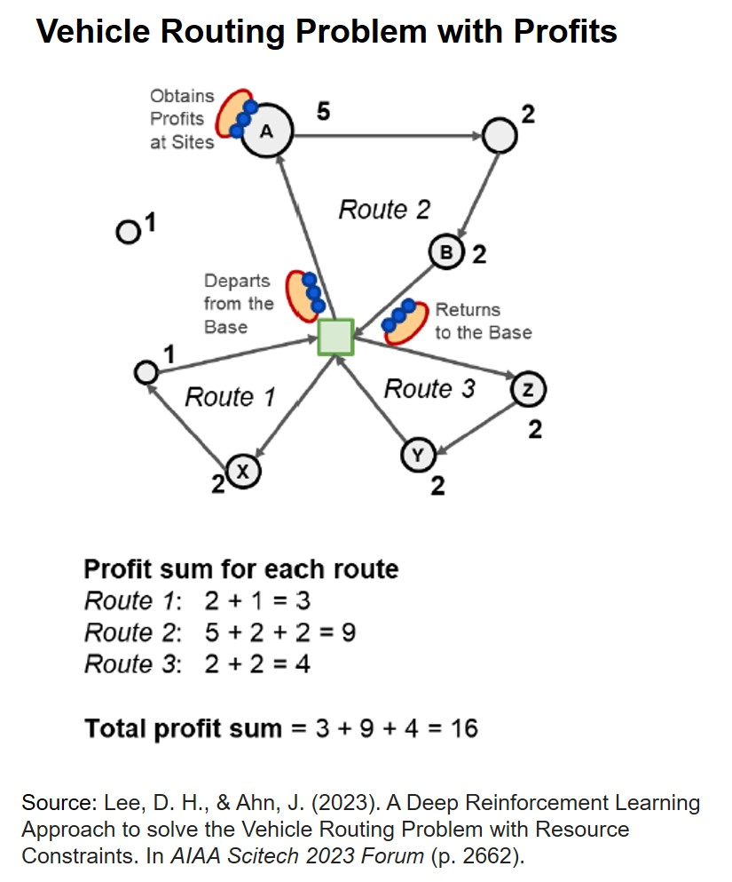
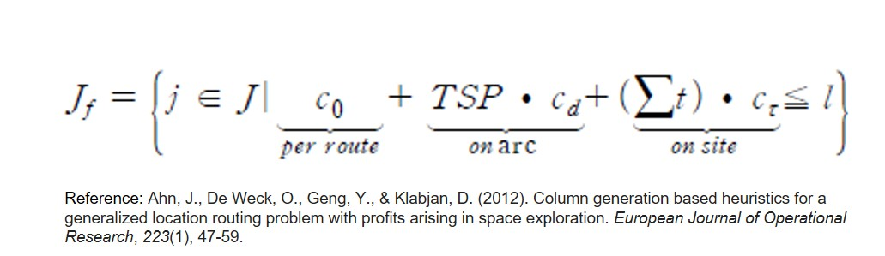
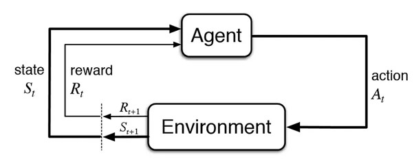
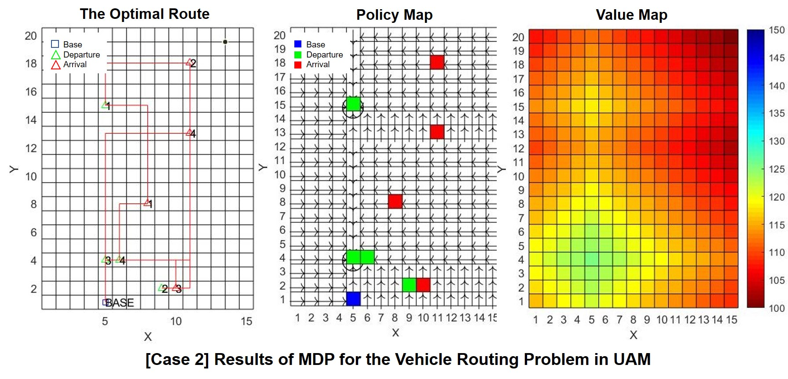

  
Summary

  **Motivation**
  - To find optimal routes for UAVs in aerial mobility, efficiently transporting passengers to on-demand locations while considering constraints like fuel limits.

  **Methods**
  - Utilized MDP(Markov Decision Process ) for vehicle routing in a grid world.
  - Assigned rewards for task completion (passenger transport) and penalties for fuel consumption and collisions.

  **Results**
  - MDP computed the optimal route based on its policy and value map.
  - Routes derived from both VRPP and MDP were identical, confirming that both methods successfully solved for the optimal route.

  **What I’ve Learned**
  - Explored various methods for solving vehicle routing problems, including VRPP (Vehicle Routing Problems with Profits) and MDP.
  - Focused on decision-making using MDP, which includes agent, environment, state, action, and reward.
  - Gained experience in implementing reinforcement learning in MATLAB.

  **Publications**
  - Conference Poster

---
## Vehicle Path Planning using MDP
Path planning for aerial vehicles plays a crucial role in Urban Air Mobility (UAM), where passengers request specific departure and arrival points on demand. Finding the optimal path is important because it directly impacts the cost and efficiency of the service. As part of an undergraduate research program, I focused on finding the optimal path for aerial vehicles in UAM scenarios, specifically those that transport passengers to multiple on-demand locations.

  

In this research, the task was to optimize the routes for unmanned aerial vehicles (UAVs) tasked with picking up passengers and dropping them off at their requested destinations. The goal was to find the shortest feasible path that meets fuel constraints while considering task priorities. Some tasks were given higher priority and offered greater rewards when completed. This path planning problem can be formulated as a Vehicle Routing Problem (VRP), which seeks to find the most cost-efficient path under constraints like fuel limits. VRP can be solved using mathematical methods such as integer linear programming, formulated as the equation below. 

  

Another approach I explored was the Markov Decision Process (MDP), which provides a more dynamic way to solve the problem by incorporating decision-making steps. MDP  is a mathematical framework that defines states, actions, and rewards to find the optimal path. In vehicle path planning, MDP helps define the different states a vehicle can be in, such as its current position, and the actions it can take, like moving forward or refueling. Each action has associated costs or rewards.

  

 In my research, the UAV received a penalty for each step it took, pushing it to find the shortest path. If the vehicle consumed more fuel than its limit, it incurred a significant penalty, indicating that the path was not feasible. Rewards were given for successfully transporting passengers to their destinations. The penalty and reward system created a policy map, which guided the vehicle's decisions. The results, as shown in the figures, display the optimal route, policy map, and value map, which outline the actions the vehicle should take at each state.

  

My research demonstrated how using VRP and MDP helps UAVs find the most efficient routes while managing fuel limits and task priorities. This flexible decision-making framework can enhance both passenger transport and goods delivery in future UAM systems. Further development, incorporating reinforcement learning, could add greater complexity and adaptability. 

